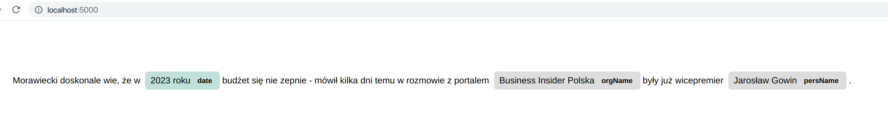

# Named Entity Recognition with Spacy


Sample repository for demonstration of SpaCy Named Entity Recognition capabilities.


## Usage:

Python console output:

```bash
$ python3 src/spacy_ner.py pl_core_news_sm "Morawiecki doskonale wie, że w 2023 roku budżet się nie zepnie - mówił kilka dni temu w rozmowie z portalem Business Insider Polska były już wicepremier Jarosław Gowin."

[
	{'text': '2023 roku', 'type': 'date', 'start_pos': 31, 'end_pos': 40}, 
	{'text': 'Business Insider Polska', 'type': 'orgName', 'start_pos': 108, 'end_pos': 131}, 
	{'text': 'Jarosław Gowin', 'type': 'persName', 'start_pos': 153, 'end_pos': 167}
]
```


DisplaCy:

```bash
$ python3 src/displacy_ner.py pl_core_news_sm "Morawiecki doskonale wie, że w 2023 roku budżet się nie zepnie - mówił kilka dni temu w rozmowie z portalem Business Insider Polska były już wicepremier Jarosław Gowin."
```

